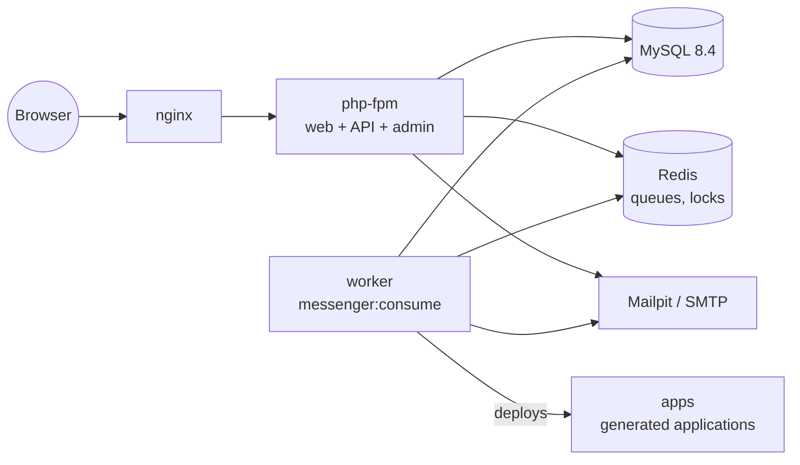
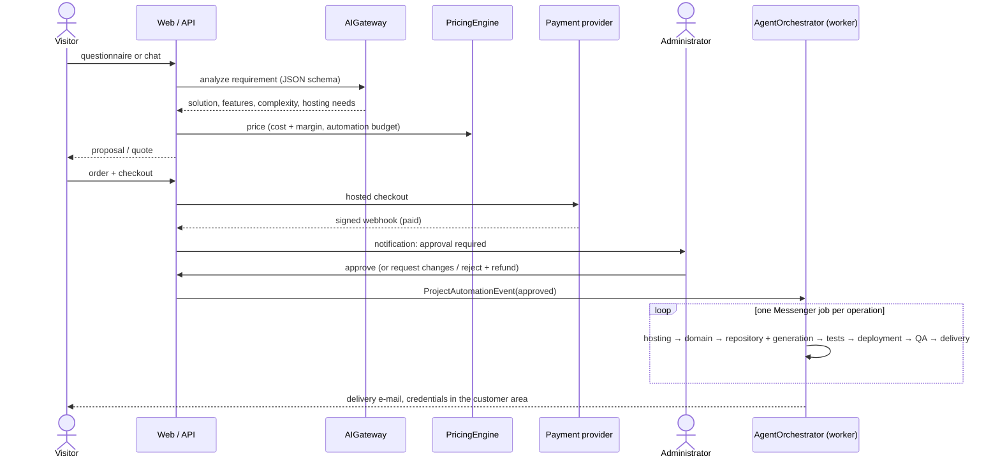
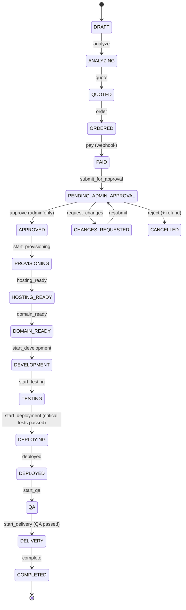

# Architecture

Mzian is a Symfony 7.4 application (PHP 8.3, Doctrine ORM, MySQL 8.4, Redis, Messenger)
organized as a modular monolith: one module per business capability, each owning its
entities, services and controllers. External services are always reached through a
provider interface, so every capability has a mock implementation and can run offline.

## Containers

| Service | Role |
| --- | --- |
| `php` | PHP-FPM: public site, customer area, admin, API, webhooks. Runs migrations and `mzian:setup` on start. |
| `worker` | `messenger:consume async notifications`: the agents and the notifications. Scale it horizontally. |
| `nginx` | Web server for `public/`. |
| `database`, `redis` | MySQL 8.4 (data), Redis (Messenger transports, locks). |
| `apps` | Plain `php:8.3-cli` server for the applications deployed by the `local_apps` provider (demo hosting). No platform code, no secrets. |
| `mailpit`, `assets` | Development only: e-mail catcher, CSS/JS build. |

## Modules (`src/`)

| Module | Responsibility |
| --- | --- |
| `Web`, `Customer`, `Lead`, `Analytics` | Public pages (SEO, fr/en/ar), customer area, lead capture and attribution, visits |
| `Catalog` | Sectors, solutions, features, subscription plans, questionnaire — imported from `config/mzian/catalog.yaml` / `questionnaire.yaml`, editable in the admin |
| `Requirement` | The customer's need: questionnaire answers, AI conversation, analysis result |
| `AI` | `AIGateway` (single entry point), providers (mock, OpenAI, Claude), `RequirementAnalyzer` (JSON schema + rules fallback), chat assistant |
| `Pricing` | `PricingEngine` (pure, no AI), `PricingPolicy`, `ProposalBuilder` (solution + hosting plan + domain + subscription) |
| `Order`, `Billing` | Quotes, orders, payments (mock, Stripe, bank transfer), invoices, subscriptions |
| `Project` | Project aggregate, workflow state machine, `ApprovalService` (human decisions), events, tasks, costs, credentials |
| `Agent` | `AgentOrchestrator`, the 7 agents, Messenger jobs, `BudgetGuard`, permissions |
| `Hosting`, `Domain`, `Development`, `Testing`, `Deployment`, `Delivery` | The pipeline steps: provider interfaces, generator, checks, credential delivery |
| `Provider` | Provider entities, `ProviderRegistry`, encrypted `CredentialVault`, mock resource store |
| `Notification` | E-mail + in-app notifications, sent asynchronously |
| `Security` | Users, roles, API tokens, voters, secret manager (libsodium), production secret checks |
| `Admin`, `Api` | Admin back-office, REST API `/api/v1` |
| `Shared` | Settings, audit log, actors, references, webhooks signatures, Twig helpers |

The generated customer application lives in `resources/application-templates/` (see
[PROVIDERS.md](PROVIDERS.md#add-an-application-template)).

## End-to-end flow

## Project state machine

Defined in PHP (`src/Project/Workflow/ProjectWorkflowDefinition.php`) and registered as
the Symfony Workflow `project` (state machine, marking = `Project::$status`).
Every transition is applied through `ProjectStateMachine`, which records a
`ProjectEvent` (timeline) and an `AuditLog` entry, and dispatches
`ProjectTransitionedEvent` (notifications, milestones).

Exceptions, available from every automation state (`APPROVED` … `DELIVERY`):

- `hold` → `WAITING_ADMIN_APPROVAL` (budget rule exceeded, retries exhausted, disabled agent,
  missing information). The state to resume at is stored on the project.
- `fail` → `FAILED` (permanent error, e.g. a provider refusing the operation).
- `resume_to_<STATE>` / `retry_to_<STATE>` (administrators only) and `cancel`.

Each transition declares which actors may apply it (metadata `actors`, enforced by
`ActorGuardListener`): customers order, webhooks pay, **only administrators approve,
reject, resume, retry or cancel**, agents only move the automation forward or put a
project on hold. Actors are resolved by `CurrentActor` (logged-in user, API token,
agent, webhook, system).

## Asynchronous work (Messenger)

| Transport | Messages | Notes |
| --- | --- | --- |
| `async` (Redis) | `ProvisionHostingMessage`, `RegisterDomainMessage`, `CreateProjectMessage`, `GenerateApplicationMessage`, `RunTestsMessage`, `DeployApplicationMessage`, `RunQaMessage`, `SendDeliveryMessage` | One job per operation, dispatched after the current transaction (`DispatchAfterCurrentBusStamp`) |
| `notifications` (Redis) | `SendNotificationMessage` | E-mail delivery, retried 5 times |
| `failed` (Doctrine) | anything that exhausted Messenger retries | `messenger:failed:show / retry` |

The orchestrator handles its own retries (exponential backoff, then an administrator
decides), so a failing agent is never silently dropped. See [AI_AGENTS.md](AI_AGENTS.md).

## Idempotency

Retries, duplicated messages and double clicks must never buy twice:

- one lock per project (`mzian-pipeline-{id}`): a single job runs at a time;
- stale or duplicated jobs are ignored (`nextOperation()` must match the job);
- every agent operation has an idempotency key `"{project reference}:{operation}"`
  (unique `agent_task.idempotency_key`);
- every provider call carries an idempotency key (e.g. `MZ-2610-AB12CD:hosting-account`);
  mock providers persist what they created (`mock_provider_resource`) and real drivers
  must pass the key to the provider API (see [PROVIDERS.md](PROVIDERS.md));
- every cost is recorded once (unique `project_cost_entry.idempotency_key`);
- payments: unique payment keys (`pay-<order>-<n>`), webhook events stored once
  (`webhook_event`), amount and currency checked against the order.

## Configuration

- Business settings (pricing, automation policy, generation defaults): defaults in
  `config/packages/mzian.yaml`, overridden in the admin (table `setting`), read through
  `SettingsService`. No price or limit is hardcoded.
- Catalog, questionnaire, providers, agents: `config/mzian/*.yaml`, imported idempotently by
  `mzian:setup`, then managed in the admin.
- Environment: `.env` (non-secret defaults) + `.env.local` / real environment variables
  for secrets. See [DEPLOYMENT.md](DEPLOYMENT.md).

## Generated applications

The development agent copies a template (`resources/application-templates/<template>`),
renders the public site with a sandboxed Twig environment (escaping on, no platform
functions), writes `mzian.json` (manifest) and `app/schema.json` (entities), and commits
the result. The application is a static website plus a dependency-free PHP/SQLite
administration engine (`_engine/`): login with throttling, CSRF, CRUD, search, calendar,
CSV export, public forms with anti-spam. Its runtime configuration (`app/config.php`:
admin e-mail, password hash, time zone) is written **only at deployment**, never committed.
