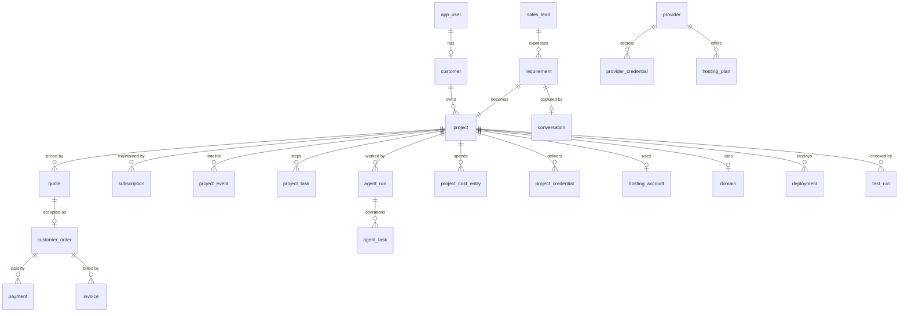

# Database

MySQL 8.4 (utf8mb4) in development and production, SQLite in the test suite. Doctrine ORM
3 with attribute mapping; one migration per schema change in `migrations/`.

Conventions:

- **Money**: integers in minor units + a `currency` column (ISO 4217). Never floats.
- **References** shown to people are generated, unique and non-sequential where they could
  be guessed: project `MZ-2610-AB12CD`, quote `Q-2610-…` (+ a 32-hex access token), order
  `ORD-2610-…`; invoices are sequential by law (`INV-2026-00001`).
- **Enums** are stored as strings (PHP backed enums); **timestamps** are UTC
  `DATETIME_IMMUTABLE`.
- **Idempotency keys** are unique columns: a retried operation finds its previous result
  instead of creating a second one.
- **Secrets** are never stored in clear: passwords are hashed (`password_hash`, Argon2id/bcrypt
  via Symfony), API tokens are stored as SHA-256 hashes, provider and project credentials are
  encrypted (libsodium secretbox, key `MZIAN_ENCRYPTION_KEY`).

## Tables by module

### Accounts and security

| Table | Purpose | Notes |
| --- | --- | --- |
| `app_user` | Login accounts (customers, administrators) | unique e-mail, roles JSON (`ROLE_CUSTOMER`, `ROLE_ADMIN`, `ROLE_SUPER_ADMIN`; `ROLE_AGENT` never combined with admin roles), active flag |
| `customer` | Customer profile (company, phone, city, sector, locale) | 1–1 with `app_user` |
| `admin_profile` | Administrator profile | 1–1 with `app_user` |
| `api_token` | Bearer tokens | SHA-256 hash only (unique), name, expiry, last use |
| `audit_log` | Every important action | actor type/id/name, action, entity type/id, old/new values (JSON, secrets excluded), IP, user agent, message |
| `setting` | Admin overrides of business settings | unique key, JSON value, updated by |

### Sales

| Table | Purpose | Notes |
| --- | --- | --- |
| `sales_lead`, `lead_activity` | Prospects, attribution (source, UTM, referrer, landing page), funnel status, activity log | |
| `visit` | Anonymous daily visits for analytics | one row per hashed visitor and day (no raw IP stored) |
| `sector`, `solution`, `solution_feature`, `question`, `subscription_plan` | Catalog (imported from YAML, editable) | unique codes / slugs; features unique per solution; questions unique per sector |
| `requirement`, `requirement_item` | A customer need: answers (one item per key, with its source), analysis JSON, recommended solution | 32-hex access token |
| `conversation`, `conversation_message` | AI chat transcripts, engine and fallback per message | 32-hex token |
| `quote`, `quote_item` | Priced proposal with cost/price per line (costs never exposed to customers), pricing snapshot, validity | |
| `customer_order`, `order_item` | Accepted quote; totals, cost, margin, status | one order per quote |
| `payment` | Checkout attempts and results | unique idempotency key `pay-<order>-<n>`, unique (provider, provider reference) |
| `invoice` | Issued invoices | sequential unique number |
| `subscription` | Maintenance plan of a project | status, price, current period |
| `webhook_event` | Received provider events | unique (provider, event id): each event processed once |

### Delivery

| Table | Purpose | Notes |
| --- | --- | --- |
| `project` | The aggregate followed from analysis to delivery | unique reference and slug, `status` (state machine), budget, spending approvals, provider overrides, hold reason / resume status, URLs, simulated flag, approval (who, when) |
| `project_event` | Timeline: every transition with actor, from/to, message, metadata | |
| `project_task` | One row per pipeline step (status, attempts, cost, output, last error, timings) | unique (project, step) |
| `project_cost_entry` | Every real (or simulated) spending | unique idempotency key: recorded once |
| `project_credential` | Credentials delivered to the customer (hosting panel, database, application admin) | encrypted value, reveal audit |
| `agent` | Agent configuration (enabled, permissions, max attempts) | unique code |
| `agent_run` | One execution of an agent: logs, status, duration, cost, tokens | |
| `agent_task` | One pipeline operation | unique idempotency key `"{reference}:{operation}"`, output |
| `provider`, `provider_credential` | Configured providers, encrypted credentials | unique code; one credential per (provider, name) |
| `mock_provider_resource` | What mock providers "created" | unique (provider, kind, idempotency key) |
| `hosting_plan`, `hosting_account`, `hosting_deployment` | Plans per provider, accounts and sites created | unique external keys |
| `domain` | Registered or customer-owned domains, DNS records, expiry | unique name (a domain belongs to one project) |
| `deployment` | Deployments (version, URLs, logs, status) | unique idempotency key |
| `test_run`, `test_result` | Automated tests and QA reports (status, score, results by check with severity) | |
| `notification` | E-mail / in-app notifications and their delivery status | |
| `messenger_messages` | Messenger `failed` transport (and Doctrine transports when Redis is not used) | |

## Main relationships



## Migrations

```bash
php bin/console doctrine:migrations:migrate          # apply (also run by the php container on start)
php bin/console doctrine:migrations:diff             # generate after a mapping change
php bin/console doctrine:schema:validate             # mapping valid and database in sync
```

Rules:

- one migration per change, committed with the code that needs it, reviewed like code;
- CI applies all migrations to an empty MySQL 8.4 and checks the schema is in sync with the
  mapping;
- production deployments run the migrations automatically and keep the previous image for a
  rollback, so migrations must be **backward compatible** (expand → deploy → contract: add a
  column, deploy code that uses it, remove the old one in a later release);
- never edit a migration that has been applied somewhere.

## Backups

Production data lives in the `database_data` volume. Back it up daily, e.g.

```bash
docker compose exec -T database sh -c 'mysqldump -uroot -p"$MYSQL_ROOT_PASSWORD" --single-transaction --routines mzian' | gzip > mzian-$(date +%F).sql.gz
```

and keep `MZIAN_ENCRYPTION_KEY` in a separate, safe place: without it the encrypted
credentials in a backup cannot be read (that is the point), and with it they can.
